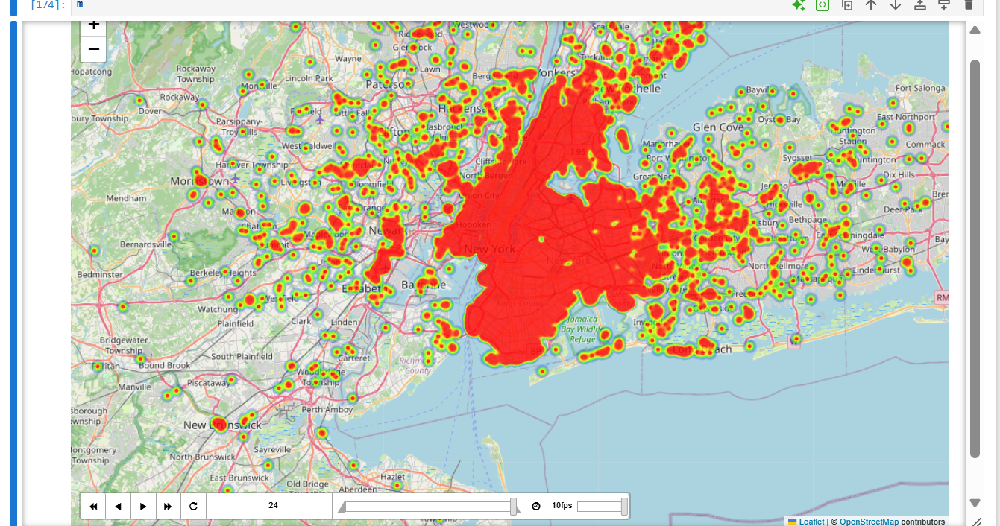

# Uber Trips Data Analysis – New York City

## Project Overview

Exploratory analysis of Uber trip data for New York City (January–June 2015) using Python. The project covers data loading, preprocessing, exploratory analysis, visualization, dispatching-base contribution, airport demand, and hourly spatial demand.

## Tools Used

- Python
- Pandas
- NumPy
- Matplotlib
- Seaborn
- Plotly
- Folium
- Jupyter Notebook

## Analysis Covered

- Data loading and initial inspection
- Data preprocessing, duplicate checks, and missing-value checks
- Monthly and weekday pickup analysis
- Hourly pickup demand by weekday
- Pareto analysis of dispatching bases
- Airport demand by hour
- Hourly spatial analysis with a time-enabled Folium heatmap

## Key Findings

- The working dataset contains 13,372,254 trip records.
- Dispatching base B02764 accounts for about 40.2% of the trips in the analyzed data.
- The top three dispatching bases together account for about 78.5% of trips.
- The top four dispatching bases together account for about 89.5% of trips.
- Hourly demand was analyzed separately across all seven weekdays to identify rush-hour patterns.

## Key Visualizations

### Monthly & Weekday Trips

### Hourly Uber Rush by Weekday

### Pareto Analysis of Dispatching Bases

### Airport Demand by Hour

### Hourly Spatial Demand

The heatmap was created with Folium `HeatMapWithTime` to explore how pickup activity changes by hour.

## Project Files

- `Uber_Data_Analysis_GitHub_clean.ipynb` – cleaned, GitHub-friendly notebook containing the analysis and visual outputs.
- `Monthly_Weekday_Trips.png` – monthly and weekday trip visualization.
- `Hourly_Uber_Rush.png` – hourly trip demand by weekday.
- `Pareto_Base_Analysis.png` – dispatching-base contribution and cumulative percentage.
- `Airport_Demand.png` – airport pickup demand by hour.
- `uber_heatmap.png` – screenshot of the interactive spatial heatmap.

## Notes

The interactive Folium map is generated by the notebook code. The GitHub notebook view does not render the interactive map, so a static screenshot is included for portfolio viewing.
